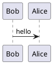

---
title:PlantUML
---
# PlantUML

让你 VuePress 站点中的 Markdown 文件支持 PlantUML 图表。

使用 [plantuml](https://www.plantuml.com/) 提供相应功能。

<!-- more -->

## 语法

````md
<!-- ↓ :preset 是可选的 -->

```puml:preset

<!-- 放置你的流程图代码 -->

```
````
目前可用的预设:

- `png` (默认)
- `svg`
- `txt`

## 示例
````md



````


```puml
@startuml
!include https://raw.githubusercontent.com/plantuml-stdlib/C4-PlantUML/master/C4_Context.puml


'Icons
!define FA_5_URL https://raw.githubusercontent.com/tupadr3/plantuml-icon-font-sprites/e53fd61259c0f2449edfe304cad83f51d0fbb5c1/font-awesome-5
!include FA_5_URL/cloud.puml
!include FA_5_URL/youtube.puml
!include FA_5_URL/server.puml

!define MATERIAL_URL https://raw.githubusercontent.com/tupadr3/plantuml-icon-font-sprites/e53fd61259c0f2449edfe304cad83f51d0fbb5c1/material
!include MATERIAL_URL/zoom_in.puml

!define osaPuml https://raw.githubusercontent.com/Crashedmind/PlantUML-opensecurityarchitecture2-icons/master
!include osaPuml/Common.puml
!include osaPuml/User/all.puml

!include <office/Servers/database_server>
!include <office/Servers/file_server>
!include <office/Servers/application_server>
!include <office/Concepts/service_application>
!include <office/Concepts/firewall>

!define AWS_PUML https://raw.githubusercontent.com/awslabs/aws-icons-for-plantuml/main/dist
!include AWS_PUML/AWSCommon.puml
!include AWS_PUML/Robotics/RoboMaker.puml

'Common Styling
skinparam wrapWidth 250

UpdateElementStyle("System", $bgColor="#ffffff", $fontColor="#000000", $shadowing="true")
UpdateElementStyle("Person", $bgColor="#e0f1fb", $fontColor="#000000", $shape=RoundedBoxShape())

AddElementTag("clickableText", $fontColor="purple")
AddElementTag("button", $bgColor="#444444", $fontColor="#ffffff")
AddElementTag("primary", $bgColor="#ffdb58", $fontColor="#000000", $shadowing="false", $borderColor="Gray")
AddElementTag("highlightBoundary", $bgColor="#fce8ee")


' Tables
!global $TYPE_X_SAMPLE_POOL_TABLE = "type_x_sample_pool"
!global $TYPE_Y_SAMPLE_POOL_TABLE = "type_y_sample_pool"
!unquoted procedure $SAMPLE_POOL_TABLE_DESC()
A subquery from which to query samples, should be joined to any
columns that you want to include in the $DAILY_COLLECTED_SAMPLES_TABLE table
!endprocedure

!global $SAMPLE_LABELS_TABLE = "some_other_label_db"
!global $SAMPLE_LABELS_ID = "sampleLabelsDb"
!global $SAMPLE_LABELS_CONTAINER_DESC = $LABELED_DATASOURCE_DESC
!global $SAMPLE_LABELS_COMPONENT_DESC = "Stores all samples which have been labeled.\n"
!global $SAMPLE_LABELS_TYPE = "BigTable"
!global $SAMPLE_LABELS_SCHEMA = "https://docs.google.com/spreadsheets"

!global $DAILY_COLLECTED_SAMPLES_TABLE = "type_y_samples_{date}"
!global $DAILY_COLLECTED_SAMPLES_ID = "dailySamplesDb"
!global $DAILY_COLLECTED_SAMPLES_DESC = "A days worth of samples collected during single run of the pipeline.\n"
!global $DAILY_COLLECTED_SAMPLES_TYPE = "BigQueryDailyTable"

!global $LABELED_DATASOURCE_ID = "labeledDatasource"
!global $LABELED_DATASOURCE_NAME = "labeled_datasource_bucket"
!global $LABELED_DATASOURCE_TYPE = "GCS"
!global $LABELED_DATASOURCE_DESC = "Where the labelers write their labeling results"

'Columns
!global $SEND_FOR_LABELING_COLUMN = "send_for_labeling"
!global $CONTENT_ID_COLUMN = "some_id"

!global $SYSTEM_NAME = "My Project Name"


left header

\t<font size=22 color=black>$SYSTEM_NAME - System View</font>

\t<font size=14 color=#484848>The goals of my project are described here</font>


end header


System(sysName, "Labeling System\n", "", $sprite="cloud", $tags="primary", $link="https://tinyurl.com/yblre3m4")

Boundary(labelers, ' \n<font color=black size=16>Labelers</font>', 'Human Resources') {
    Person(labelerB, "Labelers B", "Labeler Type 2\n", $tags="a")
    Person(labelerA, "Labelers A", "Labeler Type 2\n", $tags="a")
}
Rel_U(sysName, labelerB,"  Trigger samples for labeling")
Rel_D(labelerB, sysName," Store labeling results        ")

System(videoSamples, "Videos", "Users and internal customers", $sprite="youtube")
Rel_D(videoSamples, labelerA, " Send samples to labelers")

System(modelTrainingInference, "Model Training + Inference\n\n<font color=#e0575e><$RoboMaker></font>\n", "", $tags="secondary")
Rel_D(labelerA, modelTrainingInference," Send labels")
Rel_R(modelTrainingInference, sysName, "Send model scores")
Rel_L(sysName, modelTrainingInference, "Send labels")

HIDE_STEREOTYPE()
@enduml
```

```puml
@startuml
!include https://raw.githubusercontent.com/plantuml-stdlib/C4-PlantUML/master/C4_Container.puml


'Icons
!define FA_5_URL https://raw.githubusercontent.com/tupadr3/plantuml-icon-font-sprites/e53fd61259c0f2449edfe304cad83f51d0fbb5c1/font-awesome-5
!include FA_5_URL/cloud.puml
!include FA_5_URL/youtube.puml
!include FA_5_URL/server.puml

!define MATERIAL_URL https://raw.githubusercontent.com/tupadr3/plantuml-icon-font-sprites/e53fd61259c0f2449edfe304cad83f51d0fbb5c1/material
!include MATERIAL_URL/zoom_in.puml

!define osaPuml https://raw.githubusercontent.com/Crashedmind/PlantUML-opensecurityarchitecture2-icons/master
!include osaPuml/Common.puml
!include osaPuml/User/all.puml

!include <office/Servers/database_server>
!include <office/Servers/file_server>
!include <office/Servers/application_server>
!include <office/Concepts/service_application>
!include <office/Concepts/firewall>

!define AWS_PUML https://raw.githubusercontent.com/awslabs/aws-icons-for-plantuml/main/dist
!include AWS_PUML/AWSCommon.puml
!include AWS_PUML/Robotics/RoboMaker.puml

'Common Styling
skinparam wrapWidth 250

UpdateElementStyle("System", $bgColor="#ffffff", $fontColor="#000000", $shadowing="true")
UpdateElementStyle("Person", $bgColor="#e0f1fb", $fontColor="#000000", $shape=RoundedBoxShape())

AddElementTag("clickableText", $fontColor="purple")
AddElementTag("button", $bgColor="#444444", $fontColor="#ffffff")
AddElementTag("primary", $bgColor="#ffdb58", $fontColor="#000000", $shadowing="false", $borderColor="Gray")
AddElementTag("highlightBoundary", $bgColor="#fce8ee")


' Tables
!global $TYPE_X_SAMPLE_POOL_TABLE = "type_x_sample_pool"
!global $TYPE_Y_SAMPLE_POOL_TABLE = "type_y_sample_pool"
!unquoted procedure $SAMPLE_POOL_TABLE_DESC()
A subquery from which to query samples, should be joined to any
columns that you want to include in the $DAILY_COLLECTED_SAMPLES_TABLE table
!endprocedure

!global $SAMPLE_LABELS_TABLE = "some_other_label_db"
!global $SAMPLE_LABELS_ID = "sampleLabelsDb"
!global $SAMPLE_LABELS_CONTAINER_DESC = $LABELED_DATASOURCE_DESC
!global $SAMPLE_LABELS_COMPONENT_DESC = "Stores all samples which have been labeled.\n"
!global $SAMPLE_LABELS_TYPE = "BigTable"
!global $SAMPLE_LABELS_SCHEMA = "https://docs.google.com/spreadsheets"

!global $DAILY_COLLECTED_SAMPLES_TABLE = "type_y_samples_{date}"
!global $DAILY_COLLECTED_SAMPLES_ID = "dailySamplesDb"
!global $DAILY_COLLECTED_SAMPLES_DESC = "A days worth of samples collected during single run of the pipeline.\n"
!global $DAILY_COLLECTED_SAMPLES_TYPE = "BigQueryDailyTable"

!global $LABELED_DATASOURCE_ID = "labeledDatasource"
!global $LABELED_DATASOURCE_NAME = "labeled_datasource_bucket"
!global $LABELED_DATASOURCE_TYPE = "GCS"
!global $LABELED_DATASOURCE_DESC = "Where the labelers write their labeling results"

'Columns
!global $SEND_FOR_LABELING_COLUMN = "send_for_labeling"
!global $CONTENT_ID_COLUMN = "some_id"

!global $SYSTEM_NAME = "My Project Name"


left header

\t<font size=22 color=black>$SYSTEM_NAME - Container View</font>

\t<font size=14 color=black><U+25CF>  Goal 1</font>
\t<font size=14 color=black><U+25CF>  Goal 2</font>
\t<font size=14 color=black><U+25CF>  Goal 3</font>
\t<font size=14 color=black><U+25CF>  Goal 4</font>


end header


Person(labelerA, "Labeler A", "\t     Labeler-A Description     \t\n", $tags="a")
ContainerDb(bigQueryLabelDB, "LabelADb", "BigQuery", "A database where type A labels are stored")
ContainerDb(modelScoreDb, "ModelScoreDB", "BigQuery", "A database where model scores are stored")
Person(labelerB, "Labeler B", "\t     Labeler-B Description     \t\n", $tags="a")
ContainerDb($LABELED_DATASOURCE_ID, "$LABELED_DATASOURCE_NAME", "$LABELED_DATASOURCE_TYPE", $LABELED_DATASOURCE_DESC)
System_Boundary(sysName, ' \n<font color=black size=16>Label System FooBarBaz</font>') {
    Container(samplingPipeline, "Pipeline", "some-etl-framework", "ETL job for sampling / labeling", $tags="primary", $link="https://tinyurl.com/y9j7twkz")
    Container(labelRetrievalJob, "LabelRetrievalJob", "some-etl-framework", "DAG for retrieving and storing label data from labelers.", $tags="primary", $link="https://tinyurl.com/y8egw3wt")
    ContainerDb($SAMPLE_LABELS_ID, $SAMPLE_LABELS_TABLE, $SAMPLE_LABELS_TYPE, $SAMPLE_LABELS_COMPONENT_DESC)
    ContainerDb($DAILY_COLLECTED_SAMPLES_ID, $DAILY_COLLECTED_SAMPLES_TABLE, $DAILY_COLLECTED_SAMPLES_TYPE, $DAILY_COLLECTED_SAMPLES_DESC)
    ContainerQueue(sampleQueue, "SampleQueueFoo", "SQS", "Samples which should be double reviewed")
    Container(labelerBApi, "ReviewQueueAPI", "NodeJS", "API for pulling samples for review", $sprite="server")
    Container(btBqSnapshotJob, "ExportBigQuerySnapshot", "some-etl-framework", "A job to take daily BQ snapshots\nof //$SAMPLE_LABELS_TABLE//", $tags="primary", $link="https://tinyurl.com/yz9bm37c")
}
System(modelTrainingInference, "Model Training + Inference\n\n<font color=#e0575e><$RoboMaker></font>\n", "")

Rel_R(samplingPipeline, $DAILY_COLLECTED_SAMPLES_ID, " ")
Rel_D(samplingPipeline, sampleQueue, " ")
BiRel_D($SAMPLE_LABELS_ID, samplingPipeline, " ")
Rel_L(labelRetrievalJob, $SAMPLE_LABELS_ID, " ")
Rel_L($LABELED_DATASOURCE_ID, labelRetrievalJob, " ")
Rel_R(sampleQueue, labelerBApi, " ")
Rel_R(labelerBApi, labelerB, " ")
Rel_R(labelerB, $LABELED_DATASOURCE_ID, " ")
Rel_L(modelScoreDb, samplingPipeline, " ")
Rel_D(modelTrainingInference, modelScoreDb, " ")
Rel_D(bigQueryLabelDB, modelTrainingInference, " ")
Rel_L(labelerA, bigQueryLabelDB, " ")
Rel_L($SAMPLE_LABELS_ID, modelTrainingInference, " ")
Rel_D($SAMPLE_LABELS_ID, btBqSnapshotJob, " ")

HIDE_STEREOTYPE()
@enduml
```
